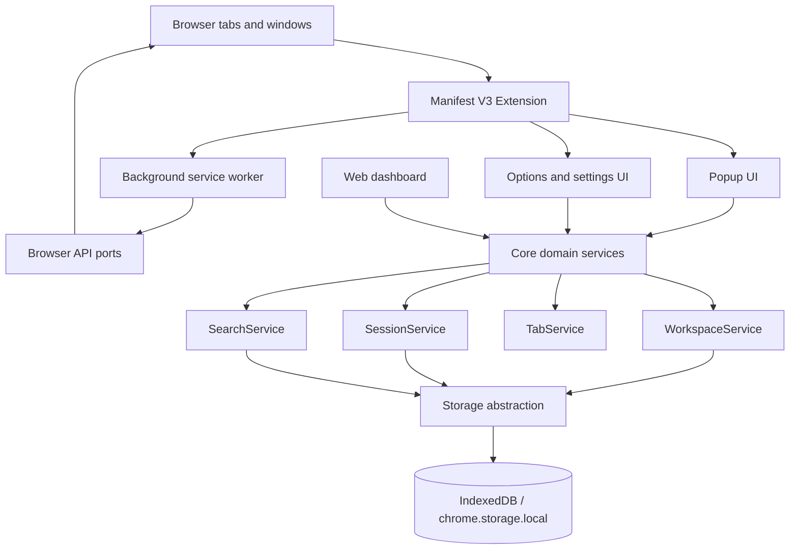
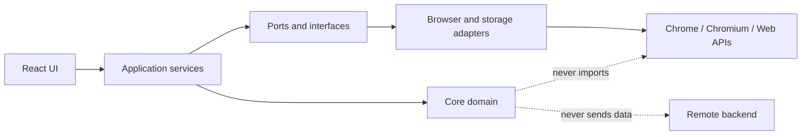
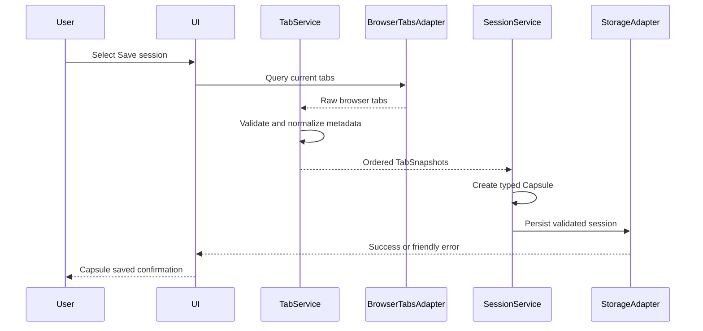
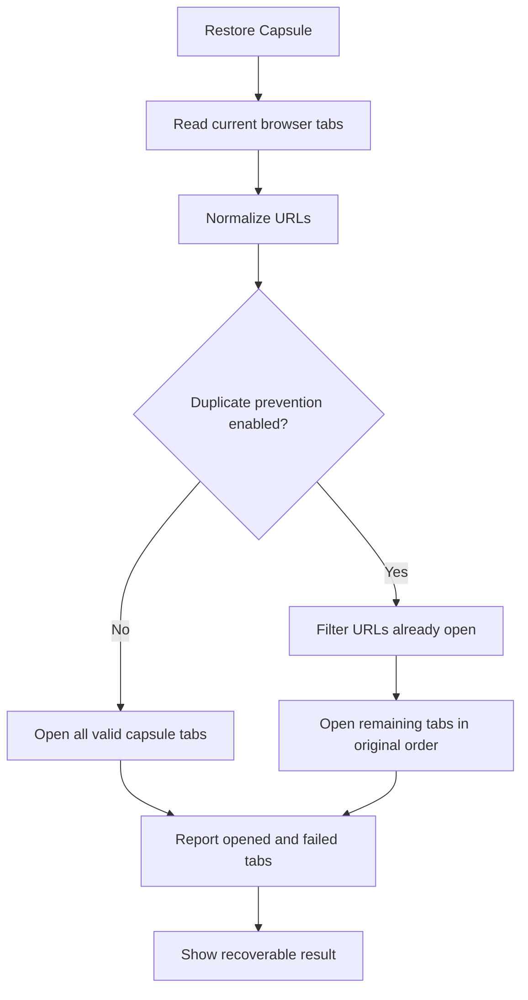
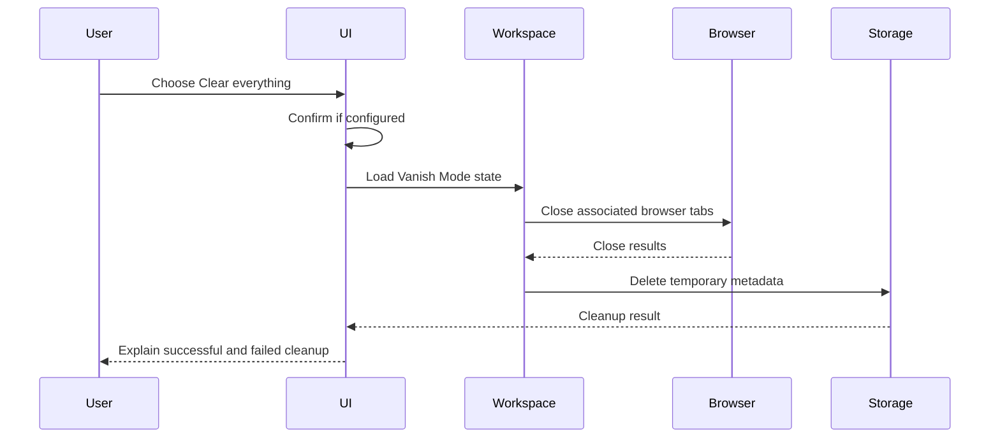
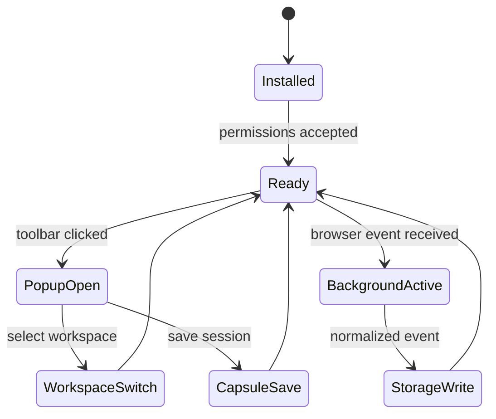

# 👻 GhostTab

> **Your tabs. Your spaces. Your privacy.**
>
> A local-first browser workspace and session manager for people who want a calmer, more intentional, and more private way to organize the web.

[](https://github.com/singharunn/ghosttab)
[](https://www.typescriptlang.org/)
[](https://react.dev/)
[](https://developer.chrome.com/docs/extensions/develop/)
[](#privacy-model)
[](#privacy-model)
[](LICENSE)

GhostTab turns a noisy browser window into a set of deliberate spaces: **Work**, **Personal**, **Study**, **Research**, **Projects**, **Temporary**, and **Vanish Mode**. Save a browser state as a **Session Capsule**, restore it later, and keep the data on your device by default.

> **Honest privacy promise:** GhostTab manages its own local workspace and session metadata. It is not an anonymity network and cannot erase records held by browsers, websites, operating systems, networks, DNS providers, ISPs, or employers.

---

## Contents

- [Why GhostTab](#why-ghosttab)
- [Product principles](#product-principles)
- [Feature overview](#feature-overview)
- [Feature matrix](#feature-matrix)
- [Architecture](#architecture)
- [Data flow](#data-flow)
- [Domain model](#domain-model)
- [Repository structure](#repository-structure)
- [Technology](#technology)
- [Getting started](#getting-started)
- [Browser extension](#browser-extension)
- [Usage guide](#usage-guide)
- [Keyboard shortcuts](#keyboard-shortcuts)
- [Privacy model](#privacy-model)
- [Security model](#security-model)
- [Permissions](#permissions)
- [Data portability](#data-portability)
- [Performance](#performance)
- [Testing](#testing)
- [Language and tooling](#language-and-tooling)
- [Roadmap](#roadmap)
- [Contributing](#contributing)
- [License](#license)

---

## Why GhostTab?

Modern browsers are excellent at opening tabs and surprisingly poor at helping people understand the state they have created. A single window can contain a production incident, a grocery order, ten research papers, a playlist, and an unfinished personal project.

GhostTab gives those activities boundaries without requiring an account or a cloud service.

| Browser problem | GhostTab answer |
|---|---|
| Hundreds of tabs become one undifferentiated stream | Workspaces group tabs by intent |
| A useful tab set disappears after closing a window | Session Capsules preserve a restorable snapshot |
| Temporary research becomes permanent clutter | Vanish Mode provides an explicit temporary space |
| Searching tabs means scanning every window | Global search indexes titles, URLs, domains, workspaces, and sessions |
| Sync services create another copy of browsing metadata | Local-first storage keeps core data on the device |
| Privacy claims are vague or exaggerated | GhostTab documents exactly what it does and does not protect |

GhostTab is not trying to become your browser. It is a focused control layer for the browser you already use.

## Product principles

### 1. Local by default

Workspace names, tab snapshots, session capsules, settings, and GhostTab-managed temporary metadata stay on the local device. No account is required for core functionality.

### 2. Privacy without theater

The product never uses language such as “100% anonymous” or “impossible to track.” It distinguishes local data ownership from complete browser anonymity.

### 3. Fast enough to disappear

Search, switching, saving, and restoring are designed around keyboard-first flows and predictable actions.

### 4. Explicit destructive actions

Clearing Vanish Mode is powerful but not magical. GhostTab confirms destructive cleanup when configured and explains what will be removed.

### 5. Browser APIs behind boundaries

The core domain does not depend on Chrome APIs. Browser-specific behavior is wrapped by adapters so services can be tested with deterministic fakes.

### 6. Portable data

Exported data is readable JSON with a schema version. Users can inspect, back up, and move their own GhostTab data.

---

## Feature overview

### Workspaces

Create unlimited named spaces with an icon, accent color, description, pinned state, tabs, and workspace-specific preferences.

| Workspace | Example contents |
|---|---|
| 💼 Work | GitHub, Gmail, Linear, Slack |
| 🏠 Personal | YouTube, Spotify, Reddit |
| 🔬 Research | Search, documentation, articles, papers |
| 🧪 Projects | One focused project context |
| 👻 Vanish Mode | Intentionally temporary browsing |

### Tabs

GhostTab captures title, URL, domain, favicon when available, pinned state, tab order, and browser identifiers where supported. Missing favicons are treated as normal and never block a workspace from loading.

### Session Capsules

A Session Capsule is a named snapshot of a browsing state containing tabs, order, workspace association, timestamps, tags, and pinned state.

Capsules can be saved, restored, renamed, duplicated, deleted, searched, and restored with duplicate prevention.

### Vanish Mode

Vanish Mode is a clearly labeled temporary workspace. Its clear operation removes GhostTab-managed temporary metadata and asks the browser adapter to close associated tabs.

It does **not** claim to remove browser history outside GhostTab, downloads, website logs, cookies unless separately supported, DNS records, network records, operating-system traces, or enterprise monitoring.

### Global search

Search across multiple object types with one query:

| Search target | Example |
|---|---|
| Tab title | `GitHub Issues` |
| URL | `github.com/org/repo` |
| Domain | `wikipedia.org` |
| Workspace | `Research` |
| Session Capsule | `Cybersecurity Research` |

### Command palette

The command palette supports Create workspace, Switch workspace, Save session, Restore session, Open Vanish Mode, Clear Vanish Mode, Search tabs, Open settings, Export data, and Import data.

---

## Feature matrix

| Capability | MVP intent | Local-only | Browser API required | Testable without browser |
|---|:---:|:---:|:---:|:---:|
| Create, rename, delete workspace | ✅ | ✅ | ❌ | ✅ |
| Duplicate and pin workspace | ✅ | ✅ | ❌ | ✅ |
| Add, remove, and reorder tabs | ✅ | ✅ | Optional | ✅ |
| Save Session Capsule | ✅ | ✅ | Optional | ✅ |
| Restore Capsule | ✅ | ✅ | ✅ | ✅ with fake adapter |
| Duplicate prevention | ✅ | ✅ | Optional | ✅ |
| Vanish Mode cleanup | ✅ | ✅ | ✅ for closing tabs | ✅ with fake adapter |
| Global search | ✅ | ✅ | ❌ | ✅ |
| JSON export/import | ✅ | ✅ | ❌ | ✅ |
| Optional cloud sync | 🚧 Future | N/A | N/A | N/A |
| Telemetry | ❌ Never by default | ✅ | ❌ | ✅ |

---

## Architecture

GhostTab uses a layered architecture. The UI knows about application services, services know about ports, and browser APIs live behind adapters.



### Dependency direction



| Layer | Responsibility | Must not do |
|---|---|---|
| UI | Render state, collect intent, show errors | Call Chrome APIs directly |
| Application services | Coordinate workflows | Render HTML or own browser globals |
| Core domain | Types, validation, pure transformations | Depend on browser runtime |
| Storage ports | Read/write validated records | Decide visual behavior |
| Browser adapters | Translate browser APIs | Persist arbitrary unvalidated data |
| Background worker | Coordinate extension events | Become a monolithic application |

### Saving a Session Capsule



### Restoring with duplicate prevention



### Vanish Mode cleanup



---

## Domain model

GhostTab uses explicit TypeScript models and runtime Zod schemas. Persisted data is treated as untrusted input, even when it originated locally.

```ts
interface Workspace {
  id: string;
  name: string;
  description?: string;
  icon: string;
  color: string;
  tabs: Tab[];
  pinned: boolean;
  settings: WorkspaceSettings;
  createdAt: Date;
  updatedAt: Date;
}

interface TabSnapshot {
  id: string;
  url: string;
  title: string;
  domain: string;
  favicon?: string;
  pinned: boolean;
  createdAt: Date;
}

interface Session {
  id: string;
  name: string;
  workspaceId: string;
  tabs: TabSnapshot[];
  description?: string;
  tags: string[];
  pinned: boolean;
  createdAt: Date;
  updatedAt: Date;
}
```

| Settings group | Examples |
|---|---|
| Appearance | Theme, font size, accent color |
| Workspace | Default workspace, startup behavior |
| Tabs | Duplicate handling, pinned restoration |
| Vanish Mode | Auto-cleanup, confirmation behavior |
| Privacy | Telemetry and analytics flags, disabled by default |
| Data | Backup intervals and retention |
| Shortcuts | Command palette, dashboard, save session |

---

## Repository structure

```text
ghosttab/
├── apps/
│   ├── extension/                 # Manifest V3 browser extension
│   │   ├── src/
│   │   │   ├── background/        # Service worker orchestration
│   │   │   ├── content/           # Minimal content integration if required
│   │   │   ├── popup/             # Quick workspace controls
│   │   │   ├── options/            # Settings and data management
│   │   │   ├── permissions/        # Permission explanations and checks
│   │   │   ├── services/           # Browser-facing application services
│   │   │   ├── storage/            # Extension storage adapter
│   │   │   └── types/              # Extension-only browser types
│   │   └── manifest.json
│   └── web/                       # Dashboard and development preview
├── packages/
│   ├── core/                      # Framework-free domain models and services
│   ├── storage/                   # IndexedDB and storage abstractions
│   ├── ui/                        # Accessible shared components and tokens
│   └── config/                    # Shared TypeScript and build configuration
├── docs/
│   ├── ARCHITECTURE.md
│   ├── PRIVACY.md
│   ├── SECURITY.md
│   ├── CONTRIBUTING.md
│   └── ROADMAP.md
├── tests/                         # Cross-package behavioral tests
├── .github/workflows/             # CI and release automation
├── package.json
├── pnpm-workspace.yaml
├── tsconfig.json
├── eslint.config.js
├── prettier.config.js
└── README.md
```

---

## Technology

| Area | Technology | Why |
|---|---|---|
| Language | TypeScript | Strong contracts across UI, extension, and domain layers |
| UI | React | Component composition and accessibility ecosystem |
| Build | Vite | Fast development server and production builds |
| Styling | CSS tokens / Tailwind-compatible direction | Compact, consistent visual system |
| Validation | Zod | Runtime validation at storage and import boundaries |
| Persistence | IndexedDB or `chrome.storage.local` | Local-first durability |
| Extension | Chromium Manifest V3 | Current Chrome extension platform |
| Tests | Vitest and Testing Library | Fast behavioral tests |
| Quality | ESLint and Prettier | Consistent, reviewable code |
| Package manager | pnpm | Efficient workspaces and reproducible dependency management |
| Automation | GitHub Actions | Build, type-check, lint, and test on every change |

---

## Getting started

### Requirements

| Requirement | Recommended |
|---|---|
| Node.js | 20 LTS or newer |
| pnpm | 9 or newer |
| Browser | Chromium-based browser for extension development |
| Git | Current stable version |

```bash
git clone https://github.com/singharunn/ghosttab.git
cd ghosttab
corepack enable
pnpm install
pnpm type-check
pnpm lint
pnpm test
```

| Command | Purpose |
|---|---|
| `pnpm dev` | Start package development processes |
| `pnpm build` | Build packages and applications |
| `pnpm test` | Run the Vitest suite |
| `pnpm test:ui` | Interactive Vitest UI |
| `pnpm type-check` | Strict TypeScript checks |
| `pnpm lint` | ESLint with warnings as failures |
| `pnpm format` | Format source and docs |
| `pnpm format:check` | Verify formatting |

---

## Browser extension

The extension follows Manifest V3 and separates the background worker, popup, options page, storage, and browser API adapters.

### Load an unpacked build

1. Run the extension build command.
2. Open `chrome://extensions` or the equivalent page.
3. Enable **Developer mode**.
4. Select **Load unpacked**.
5. Choose the generated extension directory.
6. Pin GhostTab for quick access.



GhostTab requests the smallest practical permissions. `<all_urls>` is not requested unless a specific, reviewed feature proves it is necessary.

---

## Usage guide

### Create a workspace

1. Open the dashboard or command palette.
2. Choose **Create workspace**.
3. Enter a name such as `Research` or `Project Alpha`.
4. Choose an icon, accent, and description if desired.
5. Save the workspace.

### Save a Session Capsule

1. Switch to the desired workspace.
2. Open the tabs you want to preserve.
3. Choose **Save session**.
4. Give the Capsule a useful name.
5. Add optional tags such as `research`, `release`, or `planning`.

### Restore a Capsule

1. Open **Session Capsules**.
2. Select a Capsule.
3. Choose **Restore**.
4. GhostTab validates URLs and applies duplicate handling.
5. Review the result if some tabs could not be opened.

### Use Vanish Mode

1. Switch to **Vanish Mode**.
2. Browse inside the temporary workspace.
3. Choose **Clear everything** when finished.
4. Confirm if confirmation is enabled.
5. GhostTab closes associated tabs where permitted and deletes GhostTab-managed records.

---

## Keyboard shortcuts

| Action | Windows / Linux | macOS | Customizable |
|---|---|---|:---:|
| Open command palette | `Ctrl+K` | `Cmd+K` | ✅ |
| Search tabs | `Ctrl+Shift+F` | `Cmd+Shift+F` | ✅ |
| New workspace | `Ctrl+Shift+N` | `Cmd+Shift+N` | ✅ |
| Save session | `Ctrl+Shift+S` | `Cmd+Shift+S` | ✅ |
| Open dashboard | `Ctrl+Alt+G` | `Cmd+Option+G` | ✅ |

Every shortcut has an equivalent visible command and keyboard navigation must remain accessible when shortcuts are customized.

---

## Privacy model

GhostTab is local-first, not magically anonymous.

| Data | Stored? | Purpose |
|---|:---:|---|
| Workspace names and descriptions | ✅ | Organize browser activity |
| Tab URLs and titles | ✅ | Restore and search saved state |
| Domains and favicon references | ✅ | Display useful metadata |
| Session Capsule metadata | ✅ | Save and restore context |
| Preferences | ✅ | Remember choices |
| Temporary workspace metadata | ✅ temporarily | Support cleanup |
| Telemetry events | ❌ | No telemetry by default |
| Analytics identifiers | ❌ | No analytics by default |
| Remote URL logs | ❌ | No remote logging service |

GhostTab does not provide a VPN, Tor routing, encrypted DNS, website anonymity, protection from a managed device administrator, or deletion of records maintained by websites and network providers.

The UI may display **LOCAL ONLY**, which explains that GhostTab stores workspace and session data on this device. It is not an anonymity claim.

---

## Security model

| Threat | Mitigation |
|---|---|
| Corrupted persisted data | Zod validation, schema versions, graceful fallback |
| Malformed imported URL | Validate before browser navigation |
| Arbitrary script execution | No `eval`, `new Function`, or execution of saved content |
| DOM injection | React text rendering and no unsafe HTML insertion |
| Over-broad permissions | Minimum-permission policy and documentation |
| Browser API failure | Adapters and user-facing recoverable errors |
| Duplicate restoration | URL normalization and explicit preference |
| Lost local data | JSON export and recovery workflows |
| Supply-chain compromise | Lockfile review and CI quality checks |

Security rules:

- Never execute JavaScript from a saved URL or imported JSON.
- Treat imported files as hostile input.
- Keep message payloads typed and validated.
- Keep privileged operations in the background boundary.
- Avoid `innerHTML`, `eval()`, and `new Function()`.
- Do not send URLs to remote logging systems.
- Make destructive cleanup explicit and explain its limits.

---

## Permissions

Every requested permission must answer:

| Question | Required explanation |
|---|---|
| Why is it required? | Exact feature that needs it |
| What can it access? | Narrow browser surface exposed |
| What does GhostTab do with it? | Local transformation, storage, and cleanup behavior |

Browser tab access is sensitive and is documented in the extension UI and privacy documentation.

---

## Data portability

GhostTab exports a versioned JSON document:

```json
{
  "version": 1,
  "exportedAt": "2026-01-01T12:00:00.000Z",
  "workspaces": [],
  "sessions": [],
  "settings": {}
}
```

Import flow:

1. Read the selected file locally.
2. Parse JSON without executing content.
3. Validate schema and version.
4. Show an incoming-data summary.
5. Confirm before replacing existing records.
6. Migrate supported older versions.
7. Report invalid records rather than silently dropping them.

---

## Performance

| Scenario | Design response |
|---|---|
| Hundreds of saved tabs | Normalized records and selective updates |
| Dozens of workspaces | Search indexes and filtered selectors |
| Hundreds of Capsules | Bounded or paginated views where appropriate |
| Fast search typing | Debounced query evaluation |
| Large exports | Serialize outside the render path |
| Many browser events | Batch updates and deduplicate writes |

Performance decisions should be evidence-driven. A micro-optimization is not an improvement if it makes the domain harder to review or maintain.

---

## Testing

Tests focus on behavior and boundaries, not only rendering.

| Area | Required behaviors |
|---|---|
| WorkspaceService | Create, update, duplicate, snapshot, restore |
| SessionService | Save, duplicate, merge, duplicate prevention |
| TabService | URL validation, domain extraction, snapshots, duplicates |
| Storage | Read/write, invalid data, migration, quota failure |
| Search | Title, URL, domain, workspace, Capsule matching |
| Vanish Mode | Create, clear, cleanup results, confirmation |
| Import/export | Round trip, malformed input, incompatible version |
| UI | Command navigation, creation, restore, error states |
| Browser adapters | Success and partial failure paths |

```bash
pnpm test
```

A good test answers: “What user-visible or domain-level behavior is guaranteed?”

---

## Language and tooling

GhostTab is intentionally TypeScript-first.

| Convention | Rule |
|---|---|
| Strictness | `strict: true` |
| Types | Explicit domain types at boundaries |
| Runtime data | Validate with Zod before use |
| Dates | Serialize and revive deliberately at persistence boundaries |
| Errors | Actionable, friendly messages |
| Naming | Nouns for models, verbs for service operations |
| Browser APIs | Wrapped behind adapters |
| UI state | Separate transient state from durable state |
| Async work | Handle rejection paths explicitly |

TypeScript is used because the extension, dashboard, storage layer, and domain services share security-sensitive concepts. A backend is intentionally not required for the MVP: it would introduce accounts, hosting, operational logging, synchronization conflicts, and a new place where browsing metadata could exist.

---

## Roadmap

### MVP

- [x] Monorepo foundation
- [x] Core workspace, session, tab, and settings models
- [x] Runtime validation schemas
- [x] Workspace, session, and tab domain services
- [ ] Storage adapters
- [ ] React dashboard
- [ ] Manifest V3 extension shell
- [ ] Browser tab adapter
- [ ] Search and command palette
- [ ] Vanish Mode UI and cleanup flow
- [ ] Import/export UI
- [ ] Automated CI

### Near term

- [ ] Drag-and-drop tab ordering with keyboard alternative
- [ ] Favicon caching without remote analytics
- [ ] Workspace color contrast checks
- [ ] Backup history and recovery UI
- [ ] Chromium compatibility matrix
- [ ] End-to-end extension tests
- [ ] Signed release artifacts

### Future, explicitly opt-in

- [ ] Encrypted user-controlled sync
- [ ] Conflict-aware multi-device synchronization
- [ ] Firefox/WebExtension packaging
- [ ] Workspace templates
- [ ] Optional local full-text indexing

Any future sync feature requires an explicit threat model, opt-in flow, and documentation update.

---

## Contributing

Contributions are welcome when they improve clarity, privacy, accessibility, reliability, or user control.

```bash
pnpm install
pnpm type-check
pnpm lint
pnpm test
pnpm format:check
```

Pull requests should include a problem statement, design rationale, behavioral tests, privacy and permission impact, accessibility impact, migration notes for persisted data changes, and screenshots for visible UI changes.

Prefer focused commits such as:

- `Add workspace persistence adapter`
- `Prevent duplicate capsule restoration`
- `Document tab permission rationale`
- `Improve command palette keyboard navigation`

Please read [`CONTRIBUTING.md`](CONTRIBUTING.md) and [`docs/SECURITY.md`](docs/SECURITY.md) before working on sensitive browser integrations.

---

## License

GhostTab is released under the [MIT License](LICENSE).

Copyright © 2026 Arun Singh.

---

## Closing note

GhostTab is built around a simple idea: your browser should reflect your intentions, not quietly accumulate every context you have ever opened.

**Your tabs. Your spaces. Your privacy.**
